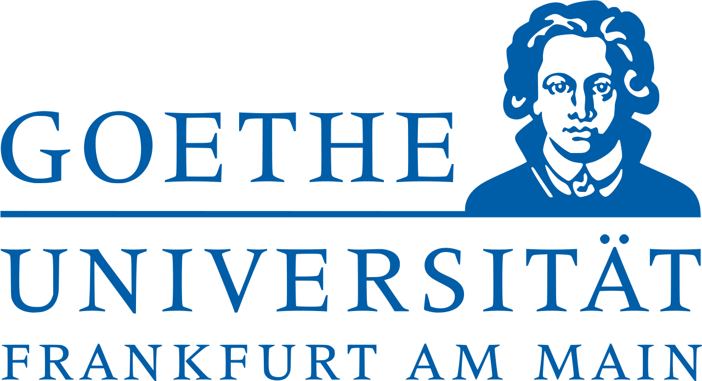
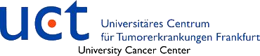
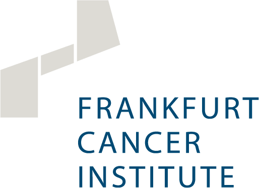

  <!-- <center> -->
  <!-- <a class="button-mail" href="https://twitter.com/K_Imkeller" role="button"><i class="bi-twitter"></i> K_Imkeller</a> -->
  <!-- <a class="button-mail" href="https://github.com/AGImkeller" role="button"><i class="bi-github"></i> AGimkeller</a> -->
  <!-- <a class="button-mail" role="button"><i class="bi-envelope"></i> ag.imkeller|gmail.com</a> -->
  <!-- <a class="button-mail" href="https://maps.app.goo.gl/CMsLp4TGBAtipw5p9" role="button"><i class="bi-geo-alt-fill"></i> Frankfurt am Main</a> -->
  <!-- </center> -->
  

::: column-page
:::

# About

The group of Computational Immunology applies mathematical and computational methods to multi-dimensional immunological and molecular data and thereby seeks to understand inter- and intra-individual heterogeneity of tumor-immune interactions in humans. Our aim is to develop a quantitative and patient-specific understanding of tumor-immune interactions on a cellular and antigen-specific level with the ultimate goal to improve patient care. 

Located at the University Hospital of the Goethe University Frankfurt am Main, we closely collaborate with experimentalists and clinicians interested in tumor immunology and immunotherapy. 

Please [contact us](mailto:ag.imkeller@gmail.com) if you're interested in collaborations or thesis projects (BSc/MSc).


```{=html}
<div  style="margin: 30px; text-align: center;">
<a class="button-52" href="openpositions/index.qmd" role="button" target="_blank" style="link-color: #495057; link-hover-decoration: none; color: #495057;">We're hiring!</a>
</div>

```


::: {.g-col-12 .g-col-md-6 .animate__animated .animate__fadeIn .animate__faster .animate__delay-1s}
## Research Projects

We use quantitative approaches to study the heterogeneity of human immune responses in cancer. Our research projects cover different areas of quatitative immunology and oncology:

- B and T cell receptor repertoires, human immunogenetics
- Spatial dynamics of adaptive tumor-immune interactions
- Computational method development for human immunology

Click [here](projects/index.qmd) to learn more about our latest research projects.

:::

::: {.g-col-12 .g-col-md-6 .animate__animated .animate__fadeIn .animate__faster .animate__delay-1s}
## News
Dec 1, 2023 --- **Jens Mayer** has joined the group as master student (Bioinformatics).\
Nov 1, 2023 --- **Jonas Schuck** has started his PhD thesis in our group. \
\

:::


::: {.g-col-12 .g-col-md-6 .animate__animated .animate__fadeIn .animate__faster .animate__delay-1s}
## Funding and Affiliations
 
<div class="bodyimgstyle">
  <a href="https://www.krebshilfe.de/"></a>
  <a href="https://www.kgu.de/"></a>
  <a href="https://www.uct-frankfurt.de/"></a>
  <a href="https://fci.health/en/"></a>
</div>
:::