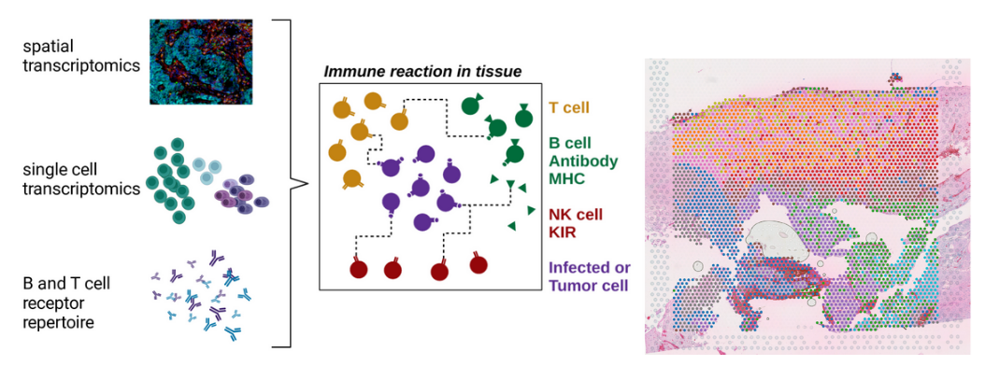
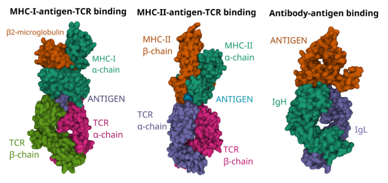

Our immune system is a powerful and versatile weapon to combat invading pathogens and emerging tumors. However, both pathogens and tumor cells frequently develop strategies to evade the elimination by immune cells. The mechanisms of tumour-immune evasion are multifaceted and arise from tumor intrinsic factors but also from the complex interplay between a cancer and its microenvironment.\
\

## Research Projects

### <a href="projects/bcells.qmd" style="color: #495057;">Tertiary lymphoid structures in solid tumours</a>
::: {layout="[2, 1]"}

- spatial aspects of the tumor microenvironment\
- adaptive immune cell repertoires in solid tumours\
- immune cell interactions and clonal dynamics\
[... more](projects/bcells.qmd)\
\
Check out our [preprint](https://www.biorxiv.org/content/10.1101/2024.07.04.602038v1.full) on tertiary lymphoid structures in Glioma.

  

:::

### <a href="projects/immunogenetics.qmd" style="color: #495057;">Computational methods for human immunogenetics</a>
::: {layout="[2, 1]"}

- human immunogenetic diversity\
- antigen specificity of immune receptors\
- development of bioinformatic methods for human immunology\
[... more](projects/immunogenetics.qmd)

  

:::

## BSc and MSc Projects

| **Title**                                                                                                                                               | **Author**        | **Study Programme**                    |
|---------------------------------------------------------------------------------------------------------------------------------------------------------|-------------------|----------------------------------------|
| Inferring cell-cell interactions in the brain metastasis microenvironment                                                                               | Jens Mayer        | MSc Bioinformatics (Goethe University) |
| Development of a multi-layer R object to study immune gene expression in spatial (and single-cell) transcriptomics at allele, gene and functional level | Jonas Schuck      | MSc Bioinformatics (Goethe University) |
| Linking Adaptive Immune Receptor Repertoires to Spatial Organization of Tumor Infiltrating Lymphocytes                                                  | Lucie Marie Hasse | BSc Bioinformatics (Goethe University) |
