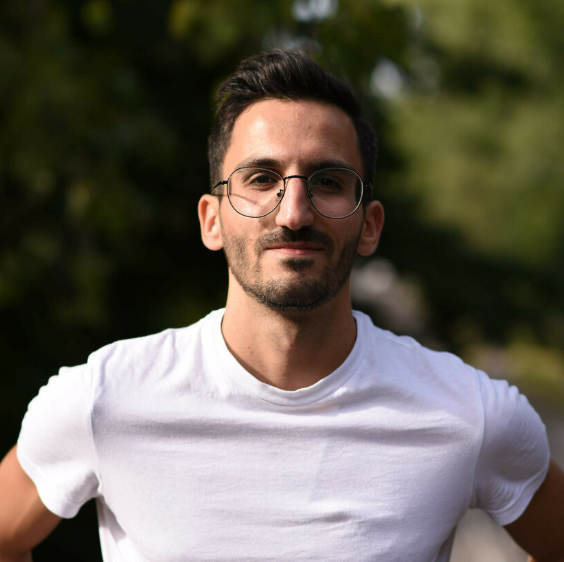

::: {.grid}

::: {.g-col-5}
\
\

   

  

  <a class="button-linkedin" href="https://www.linkedin.com/in/ahmad-al-ajami-2ba577168/s" role="button"><i class="bi-linkedin"></i> Ahmad Al Ajami</a>
  <a class="button-mail" role="button"><i class="bi-envelope"></i> alajami|rz.uni-frankfurt.de</a>
  

  

:::

::: {.g-col-5}

&emsp;

# Ahmad Al Ajami

## Research
**PhD Student, Neurologisches Institut (Edinger Institut)**, Universitätsklinikum Frankfurt, Germany \
**MSc Student, Group of Statistical Bioinformatics**, University of Zürich, Switzerland \
**MSc Student, Department of Cancer Immunotherapy Discovery**, Roche, Switzerland \

## Education
**Master of Science in Computational Biology and Bioinformatics**, ETH, Switzerland \
**Bachelor of Science in Genetics and Bioinformatics**, Bahcesehir University, Turkey \
**Erasmus Semester**, University of Copenhagen, Denmark \
**Exchange Student**, Syracuse University, USA

:::

:::
