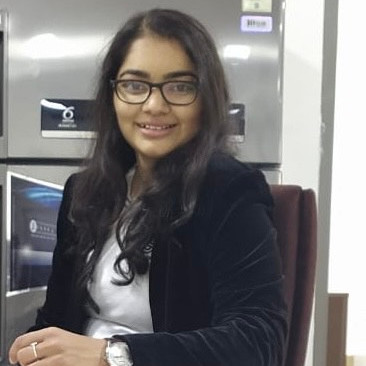

::: {.grid}

::: {.g-col-5}
\
\

   

  

  <a class="button-mail" role="button"><i class="bi-envelope"></i> Gandhi | med.uni-frankfurt.de</a>
  

  

:::

::: {.g-col-5}

&emsp;

# Devarshi Gandhi

## Research
**Student Assistant at Edinger Institute**, University Clinic Frankfurt am Main, Germany - Now \
**MSc student, Immunohistochemistry Department**, The Gujarat Cancer & Research Institute, India

## Education
**Master of Science in Molecular Biotechnology** , Anhalt University of Applied Sciences, Germany - Now \
**Master of Science in Cancer Biology**, The Gujarat Cancer & Research Institute, India \
**Bachelor of Science in Biotechnology**, The Gujarat University, India

:::

:::
