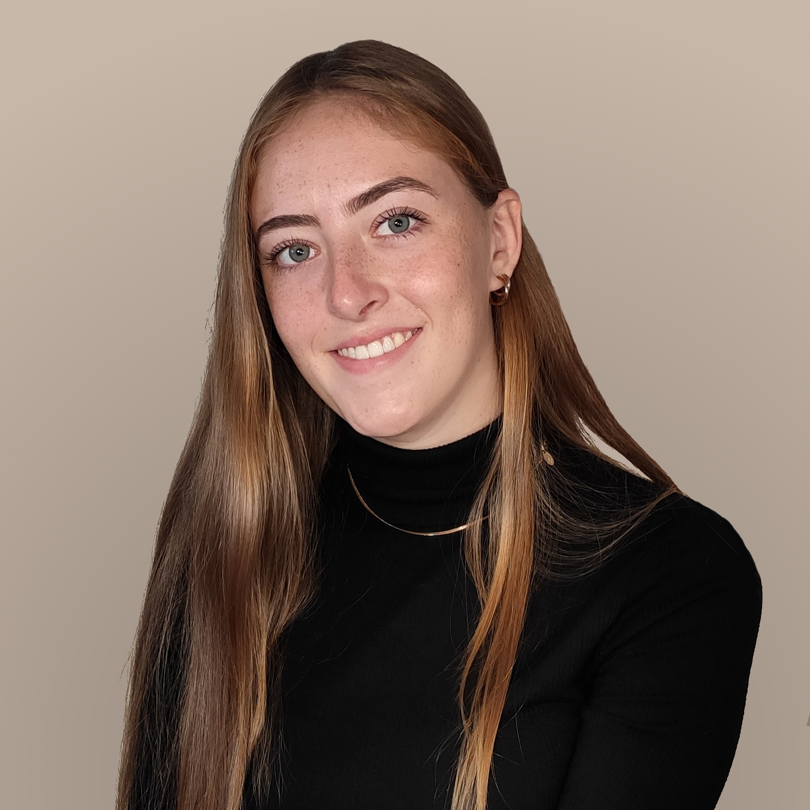

::: {.grid}

::: {.g-col-5}
\
\

   

  

  <a class="button-linkedin" href="https://www.linkedin.com/in/lucie-marie-hasse-045497256/" role="button"><i class="bi-linkedin"></i> Lucie Marie Hasse</a>
  <a class="button-github" href="https://github.com/lmhasse" role="button"><i class="bi-github"></i> lmhasse</a>
  <a class="button-mail" role="button"><i class="bi-envelope"></i> hasse|med.uni-frankfurt.de</a>
  

  

:::

::: {.g-col-5}

&emsp;

# Lucie Marie Hasse

## Research
**Student Assistant at Edinger Institute**, University Clinic Frankfurt am Main, Germany (2021-now) \
**Student Intern, Robinson Lab**, Department of Molecular Life Sciences, University of Zurich, Switzerland \
**Student Intern, Hiller Lab**, LOEWE Centre for translational biodiversity genomics, Frankfurt am Main, Germany \

## Education
**Master of Science in Bioinformatics**, Goethe University Frankfurt,Germany (2023-now) \
**Bachelor of Science in Bioinformatics**, Goethe University Frankfurt, Germany (2020-2023)

:::

:::
