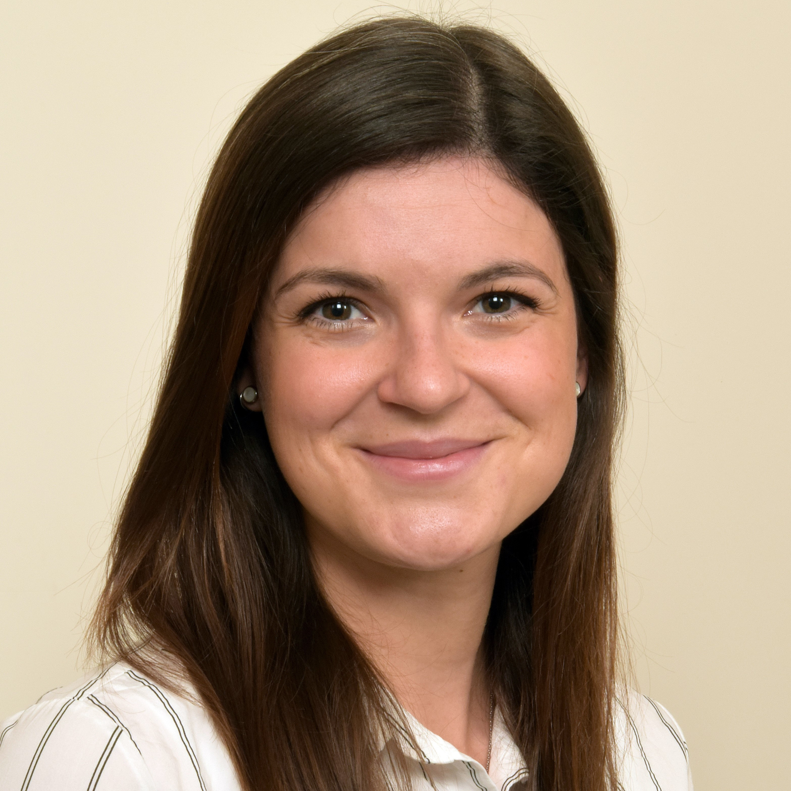

::: {.grid}

::: {.g-col-5}
\
\

   

  

  <a class="button-linkedin" href="www.linkedin.com/in/samira-ortega-iannazzo-578483229" role="button"><i class="bi-linkedin"></i> Samira Ortega Iannazzo</a>
  <a class="button-mail" role="button"><i class="bi-envelope"></i> iannazzo | rz.uni-frankfurt.de</a>
  

  

:::

::: {.g-col-5}

&emsp;

# Samira Ortega Iannazzo

## Research
**PostDoc**, Neurologisches Institut (Edinger Institut), Universitätsklinikum Frankfurt, Germany \

**PhD Student**, Division of Immunology, Paul-Ehrlich-Institut, Langen, Germany \

**MSc Student**, Research Group Product “Testing of Immunological Biomedicines”, Paul-Ehrlich-Institut, Langen, Germany \

**BSc Student**, Project Group “Bioresources”, Sanofi-Fraunhofer IME Cooperartion, Gießen, Germany 

## Education
**Master of Science in Biology**, Technical University Darmstadt, Germany \
**Bachelor of Science in Technical Biology**, Technical University Darmstadt, Germany

:::

:::

