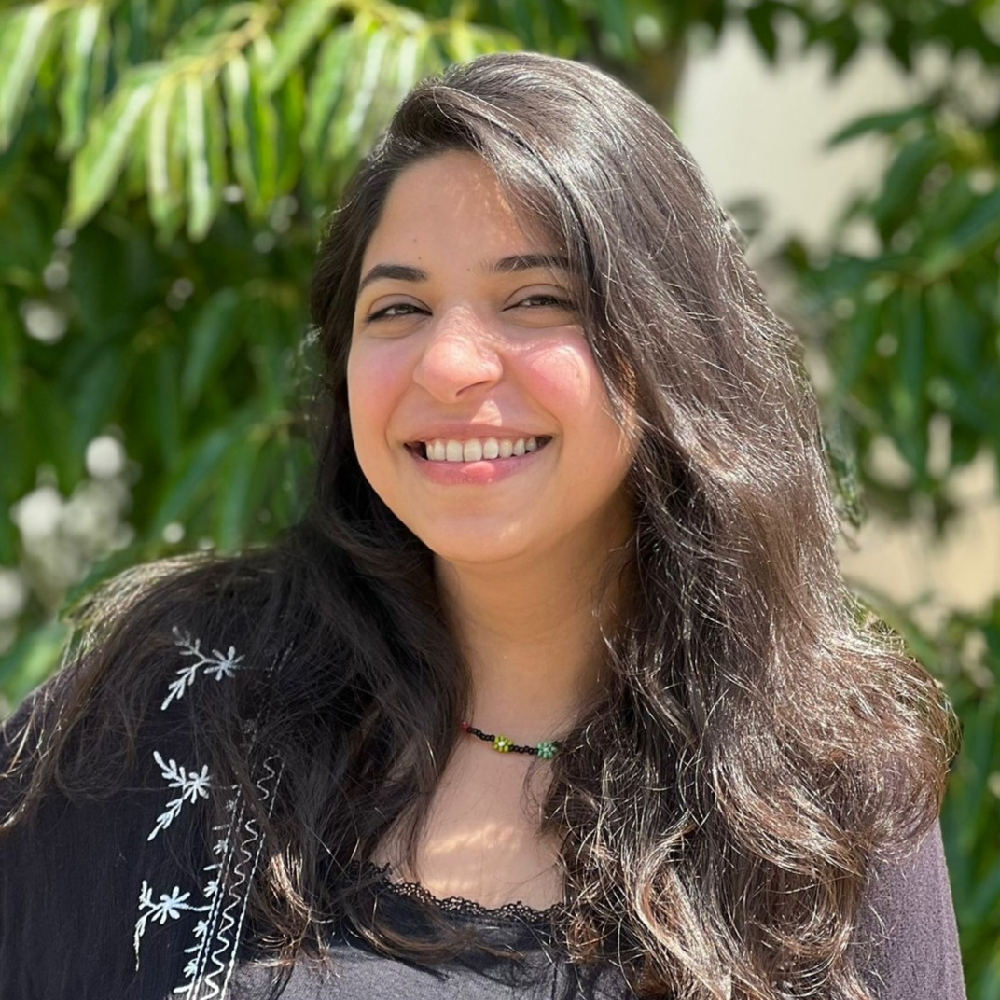

::: {.grid}

::: {.g-col-5}
\
\

   

  

  <a class="button-linkedin" href="https://www.linkedin.com/in/zeina-yasserr/" role="button"><i class="bi-linkedin"></i> Zeina Yasser</a>
  <a class="button-mail" role="button"><i class="bi-envelope"></i> mahmoud|med.uni-frankfurt.de</a>
  

  

:::

::: {.g-col-5}

&emsp;

# Zeina Yasser

## Research
**Student Assistant at Edinger Institute**, University Clinic Frankfurt am Main

## Education
**Current: Master of Physical Biology of Cells and Cell Interactions**, Goethe University, Frankfurt am Main \
**Bachelor of Biotechnology**, Misr University for Science and Technology, Egypt

:::

:::
